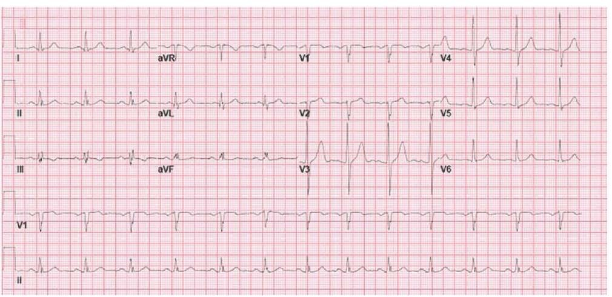
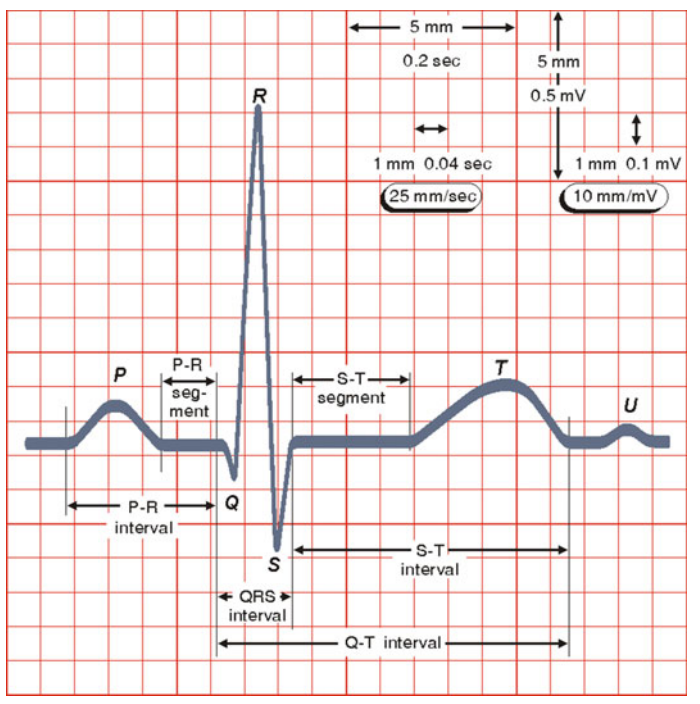
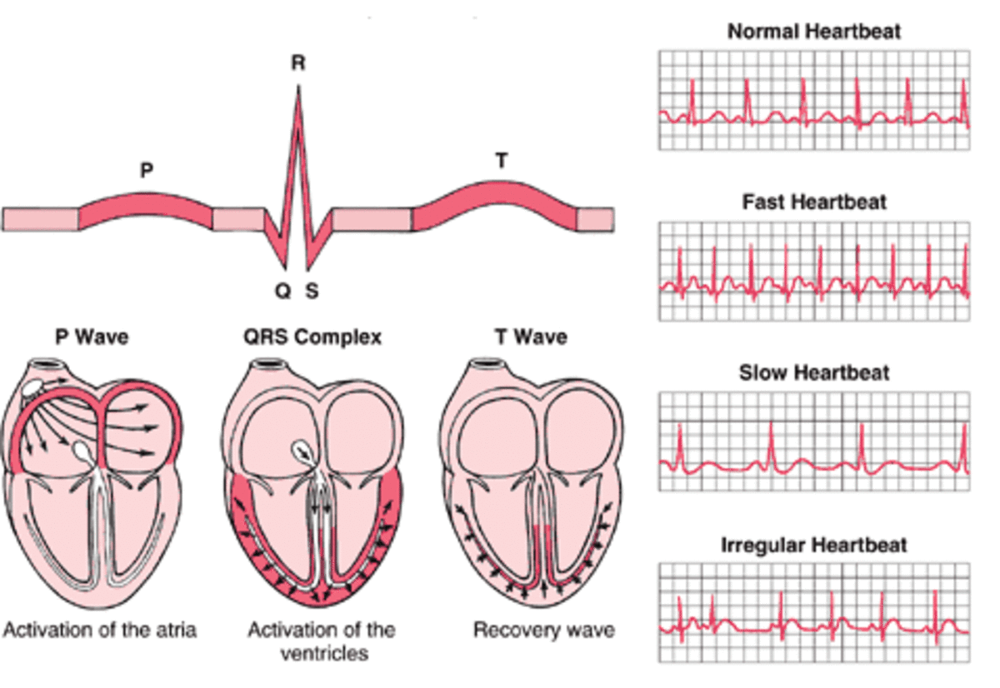
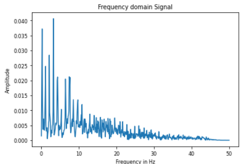

# An Introduction to ECG data

## Table of Contents

1. [Section 1: What is ECG data?](#section-1-what-is-ecg-data)
2. [Section 2: Reading an ECG](#section-2-reading-an-ecg)
3. [Section 3: Exploring ECG data](#section-3-exploring-ecg-data)
4. [Section 4: Feature Engineering with ECG data](#section-4-feature-engineering-with-ecg-data)
5. [Section 5: Models for classifying ECG data](#section-5-models-for-classifying-ecg-data)
 

## Section 1: What is ECG data?

ECG is short for an "**E**lectro**c**ardio**g**ram". It is a tool frequently used by doctors that gives information on the heart health of a patient.

### Part 1.1: What does ECG data measure?

First, we need to understand how the heart works. The heart works by creating its own bio-electricity that flows throughout the heart, causing the heart to contract and relax in time. This constant contraction and relaxing is what we recognise as the beating of the heart. The eletrical currents are created in the same position in every heart and flows through the heart in a predictable manner. By measuring and interpreting these electrical currents, doctors can gauge the health of the heart. Abnormal readings, such as irregular current flow or irregular amplitudes, tell us that the heart is working abnormally.

### Part 1.2: How is ECG data taken?

The heart is located in 3-dimensional space; doctors have agreed upon a standardised way of viewing these electrical currents. There is a 'vertical view', and a 'horizontal view'. ECG data is taken by placing circular electrodes called 'leads' at certain points on the body. 

The vertical view corresponds to the six limb leads, where data is calculated from leads places on the extremitis of the 4 limbs. These limb leads are called (I, II, III, AVR, AVL, and AVF). 

The horizontal view corresponds to the six precordial leads, where data is calculated from leads places on the left side of the chest, close to each other.  These precordial leads are called (V1, V2, V3, V4, V5, V6).

Unfortunately, the term 'leads' is overloaded. This means that 'lead' refers to more than one thing. While it can refer to the electrodes used in measuring the electrical currents, 'lead' can also refer to the specific 'view'. So we might refer to the limb-lead 'I', or the lead 'V2'.

An ECG that contains all 12 of the above leads is called a 12-lead ECG. The 12-lead ECG is the most common type of ECG you will find in hospitals as it provides the most amount of information. An EcG does not need to contain all 12 leads and can have only 1-lead, called a uni-lead ECG, or be multi-lead, where more than 1-lead is used. A common multi-lead ECG that is not 12-lead is the 2-lead ECG.

ECG data, like other electronic signal data, have to be sampled at a certain rate. A sampling rate of 100 Hz means that 100 readings will be taken for 1 second. A higher sampling rate means that more data is captured, but storage and processing speed is sacrificed. The PTB-XL dataset used in this project was initially sampled in 500 Hz, but a downsampled version of 100 Hz was included for ease of use. This project uses the 100 Hz version as loading times were an issue when using the 500 Hz version.

### Part 1.3: Classifying ECGs

For data scientists, the most important category name to remember is 'normal sinus rhythm'. This means that the heartbeat is normal. There are other sinus rhythms that are abnormal, alongside several other abnormal conditions.

## Section 2: Reading an ECG

### Part 2.1: A standard ECG layout

Below is a typical example of an ECG.

Figure 1: A typical example of an ECG reading. This image is taken from [what-when-how.com](http://what-when-how.com/paramedic-care/diagnostic-ecgthe-12-lead-clinical-essentials-paramedic-care-part-2/).

The ECG is divided into several sections. The main readings are the first 3 lines from the top starting with I, II, and III and going right, top to bottom from aVR, aVL, all the way to V6. All of these leads refer to the same time period of, say, 2-3 seconds where the electrical signals were measured. Each 'blip' in the wave is a heartbeat. The first 'blip' of every lead refers to the same heartbeat, but seen from different areas of the heart.

The last two lines, called V1 and II, are the same V1 and II readings in the first 3 lines, but extended in duration. This extended reading gives doctors more information on more long-term trends in the heartbeats rather than just 2-3 seconds. These last 2 lines do not appear in every ECG and are optional.

The ECG paper the readings are on are split into 'large squares' and 'small squares'. Small squares are 1mm long and normally represents 0.1 mV on the vertical axis. 5 small squares make up a large square, which are 5mm long and represents 0.5 mV on the vertical axis. On a standard ECG paper, the speed of recording is 25 mm/s, so on the horizontal axis, one small square represents 0.04 s and one large square represents 0.20 s.

On the far left are vertical bars that are very tall. These are simply calibration readings that ensure that the ECG recordings are standard. For our purposes as data scientists, they can be ignored at this stage.

### Part 2.2: A standard heartbeat

Below is a zoomed in picture of one heartbeat

Figure 2: An ecg of one heartbeat. The fiducial points all point to normal sinus rhythm. Taken from "Time-Domain Analysis of the Electrocardiogram", 2019, by Ioanna Chouvarda et al.

To begin to understand this picture, we need to understand 'depolarization' and 'repolarization'. A heartbeat begins with depolarization, where the electrical potential changes from negative to positive. This change leads to the contracting of the heart in that area. After depolarization, that area of the heart has to repolarize, where the electrical potential returns from positive to negative, allowing that area to depolarize and contract again. The different areas of the heartbeat above, labelled P, QRS, T, and U, simply represent the depolarization and repolarization of different areas of the heart.

This idea of the heart being split into different sections is important. There are 4 chambers in the heart and the electrical signal starts from the upper right chamber of the heart (upper left when viewing the heart on a piece of paper) where it is created, flows downwards through the center, and spreads to the outer layer of the lower chambers.

Figure 3: An image showing where electricity flowing through the heart corresponds to a heartbeat on an ECG. This gif taken from [hubpages](https://discover.hubpages.com/education/Heart-Rhythms) 

#### Part 2.2.1: The P-wave

The P-wave corresponds to the creation of the electrical signal via depolarization of the upper right chamber of the heart. This chamber is called the 'right atrium', and depolarization of this area is called 'atrial depolarization'. This is represented through a raised bump on the left side of the heartbeat. The depolarization of the right atrium causes the left atrium to contract too, so the upper chambers of the heart contract before the lower chambers.

#### Part 2.2.2: The QRS complex

This electrical signal continues downwards, through the layer of muscle that separates the left half of the heart from the right, and depolarizes the lower left and right heart chambers. These chambers are called the 'left ventricle' and 'right ventricle' respectively. This corresponds to the large spike in the middle, with the left and right edges of this spike called the Q-peak and S-peak respectively, and the maxima of this spike being called the R-peak. Together, these peaks form the QRS complex. 

Repolarization of the right atrium also happens in this time, but right atrial repolarization signal is weaker than the depolarization of the left and right ventricles and so cannot be seen on an ECG.

#### Part 2.2.3: The T-wave

All 4 chambers of the heart have contracted, resulting in a beat. The T-wave represents the repolarization of the left and right ventricles, represented as a raised bump on the right side of the heartbeat. After repolarization, the heart can send another signal from the right atrium again, resulting in the start of another heartbeat.

Sometimes, you might notice a wave coming right after the T-wave. This wave is called a U-wave and researchers and doctors are still not sure what causes it. The U-wave does not appear all the time and can be safely ignored by data scientists just starting to understand ECG data.

## Section 3: Exploring ECG data

Now that we understand the basics of reading an ECG, we can start exploring ECG data.

### Part 3.1: What type of data is ECG data?

ECG data is a type of time-series, so anything we can do with time-series normally, we can do to ECG data. However, not all actions we can take make sense. For example, in financial time-series data, we might want to take an auto-correlation, where we lag the signal by, say, a day, and see if the time-series correlates with itself lagged by a day. However, auto-correlation makes no sense in analysing ECG data, so we should not apply that.

ECG data is also a kind of signal, so advances made in signal processing, particularly in bio-signal processing, will be relevant to our needs.

### Part 3.2: Time domain, frequency domain, and time-frequency domain

#### Part 3.2.1: Time domain

The most common view of time-series data is data viewed in the time domain. This means the horizontal axis represents time, and the data shows how the signal changes over time. Doctors normally view ECGs in the time domain, and all the images of ECGs in this write-up are also in the time domain. However, there are also 2 other domains we might be interested in. We can represent the data in the frequency domain, and in the time-frequency domain.

#### Part 3.2.2: Frequency domain

The frequency domain can show us how much of the signal lies in different frequency ranges by showing the signal with respect to frequency (represented in Hertz, Hz). An example can be taken from notebook 02 of this repo, where we do data analysis.

Figure 4: An ECG shown in the frequency domain.

In this case, a lot of the energy can be found in the lower frequencies, and there are less energies found in the higher frequencies. The information found in this representation of the ECG will be helpful in feature engineering, where it can augment features we can extract from the time domain representation of the ECG.

#### Part 3.2.3: Time-frequency domain

Unfortunately, analysing the signal in the frequency domain means that we cannot analyse the signal with regards to time. Signal processing researchers have come up with a way to analyse signals with respect to both time and frequency, by framing the signal  in the time-frequency domain.

#### Part 3.2.4: Converting a signal between the 3 domains

To analyse an ECG in each of the domains, we need to be able to convert between them. Fortunately, there are methods to do so.

From **time domain to frequency domain**: Fast-Fourier Transform (FFT)

From **frequency domain to time domain**: Inverse Fast-Fourier Transform (IFFT)

From **time domain to time-frequency domain**: Short-Time Fourier Transform (STFT). However, there are problems with this method. Another method that overcomes these short comings is the Continuous Wavelet Transform (CWT).

From **time-frequency domain to time domain** Inverse Short-Time Fourier Transform (ISTFT). Inverse Continuous Wavelet Transform.

From **frequency domain to time-frequency domain**: As far as I know, STFT and CWT too.

From **time-frequency domain to frequency domain**: I am uncertain.

For our purposes, FFT and CWT will be used.

### Part 3.3: Libraries used

We can talk about the libraries for signal processing in general, and those for bio-signals in particular, including ECGs. These libraries are used in notebook 02 for data analysis.

#### Part 3.3.1: Libraries used to process signals in general

Scipy has a Signals module, scipy.signal, which is used for signal processing in general.

Scipy also includes an fftpack module, scipy.fftpack, from which you can import fft to do fast-fourier transform.

[PyWavelets](https://readthedocs.org/projects/pywavelets/), pywt, is a library that can be used for discrete transforms.

[TsFresh](https://tsfresh.com/) is a library that allows you to extract features from time-series data easily.

#### Part 3.3.2: Libraries used to process bio-signals, including ECG data

The biggest general python library for bio-signal processing is [Neurokit2](https://neurokit2.readthedocs.io/en/latest/), which has modules for different bio-signals.

For datasets from Physionet, you can use the inbuilt wfdb library, which stands for Waveform Database.

This repository also uses ecg_plot for plotting ECGs.

## Section 4: Feature Engineering with ECG data

There are 3 types of features we can engineer from ECG data.

First, there are statistical features. Statistics like the Mean, Standard Deviation, Kurtosis, and Skew can be used as features. This project uses Kurtosis and Skew.

Second, there are morphological data that can be extracted from the ECG, mimicking the features that doctors look out for when they analyse an ECG. This includes:

 - **RR-peaks**: This feature represents the distances between R-peaks. This is the most common feature extracted. This project extracts the maximum amplitudes of leads, which are normally the RR-peaks.
 
 - **QRS complex detection**: There is [research into algorithms that can detect the QRS complex](https://biomedical-engineering-online.biomedcentral.com/articles/10.1186/s12938-018-0441-4), where characteristics such as QRS complex length can give information on the presence of abnormal heart beats. This project does not use this feature.
 
 - **P-wave & T-wave detection**: Similar to QRS complex detection, there is [research into detecting P-waves and T-waves](https://pubmed.ncbi.nlm.nih.gov/2914427/), which can give information on whether there are abnormalities in depolarization and repolarization. This project does not use this feature.
 
 - **Peak amplitudes**: The peak heights represent the voltage going through the heart. This project uses this feature.
 
Third, there are frequency domain and time-frequency domain features. This project uses the summed values in a fast-fourier transform for frequency domain features and the summed values of the short-time fourier transform for time-frequency domain features.

This project refers heavily to the paper "[A cascaded classifier for multi-lead ECG based on feature fusion](https://www.sciencedirect.com/science/article/abs/pii/S0169260719305747)", released in September 2019 by Chen et al. This is one of a few papers that discuss multi-lead feature engineering, as most papers on ECG feature engineering normally refer to uni-lead ECG feature engineering.

## Section 5: Models for classifying ECG data

### Part 5.1: Neural Network methodologies

Like other classification tasks, current methodology uses different Neural Network architectures for ECG data classification. Convolutional Neural Networks (CNN) are especially important in multi-lead classification. This project uses the recent [MTEX-CNN architecture](https://ieeexplore.ieee.org/document/8970899/) used for multivariate time-series data that has the advantage of being explainable with something called a grad-CAM visualisation. The grad-CAM allows for heatmaps to be drawn which incicate what features are most important.

Another explainable CNN that criticises MTEX-CNN is the [XCM architecture](https://deepai.org/publication/xcm-an-explainable-convolutional-neural-network-for-multivariate-time-series-classification). This project refers to the specified MTEX-CNN structure in XCM.

### Part 5.2: Non-Neural Network methodologies

#### Part 5.2.1: KNN-DTW

The very first method used for classifying ECG data was the K-Nearest Neighbour algorithm that used Dynamic Time Warping (DTW)as a distance metric, commonly termed KNN-DTW. KNN-DTW works by comparing the unknown ECG signal with a known, classified ECG signal and comparing how similar they are. The notion of distance is used as a metric for similarity. The intuition is that the closer the signal waves are to one another, the more similar they are. DTW is the metric used for time-series instead of Euclidean distance because DTW takes into account distance warping.

#### Part 5.2.2: Cascading classifiers

Another popular method used for classifying ECG data uses cascading classifiers. This is an ensemble method that feeds data through classifiers one-by-one until classification is complete. A prime example of this that achieved extremely high accuracy is [COTE](https://ieeexplore.ieee.org/document/7069254), which stands for "Collective Of Transformation-based Ensembles"), explained in 2016 by Bagnall et al. COTE was later extended by Lines et al. to create [HIVE-COTE](https://ieeexplore.ieee.org/document/7837946/).

COTE and HIVE-COTE is an ensemble of 35 and 37 classifiers respectively. While they achieve very high accuracy, the cost is an extremely slow training process as 37 classifier hyperparameters need to be tuned. This time cost increases when paired with cross-validation.

This paper uses a cascading classifier comprising a random forest and a fully-connected neural network consisting of 5 hidden layers. This was taken from "[A cascaded classifier for multi-lead ECG based on feature fusion](https://www.sciencedirect.com/science/article/abs/pii/S0169260719305747)" mentioned above.